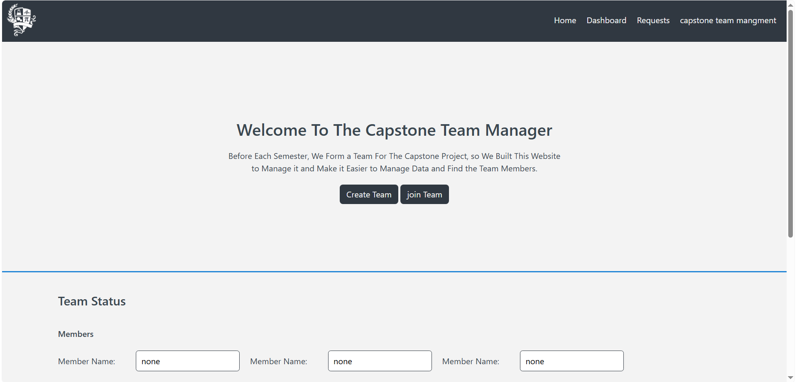
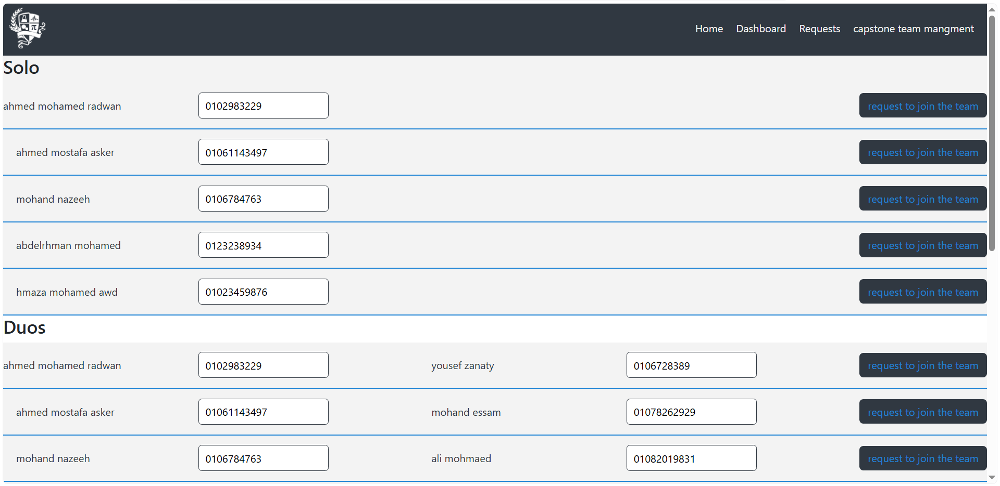
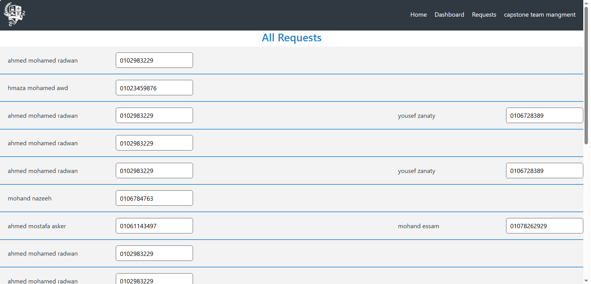
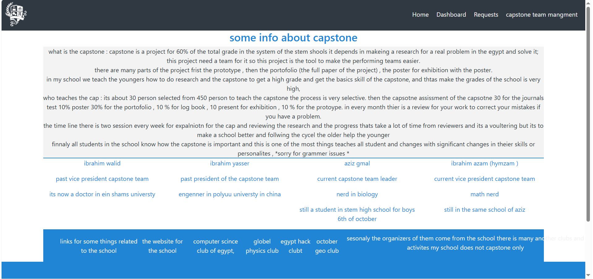

# Capstone project 

it is team project i worked on with my teammate ahmed asker
the idea of the project comes from that we are in STEM HIGH SCHOOL FOR BOYS 6TH OF OCTOBER SCHOOL 
in this school we have a capstone challange which is a projects depends on the team work 
so we made this website to help in the part of team divition 

## Features
this website is little simple as we don't have a backend dev to work with fire base so we tried to make a small design for the site and tried to make so functions to it by the js.

### stark part of work 
in this project i worked on the login page and sign up page of it 
first i started by making a design for the webstie using a color pallete in this part i see a beautiful color on the internet and i wanted to use it so i asked ai about the hex code of the color and tried it and after some time my teammate asked me to change it so i used the color in the pallets then i made a two glowing circles then i made the header of the of the login and sign up pages and then i go to the left part that has text after styling the text in the left part i went to the right part i made the input fields that i will need, the outer card, and the botton and finally i styled them all. after this part i copied the code and put it in the sign up page and i updated small parts and finally i finished the design of the page. then i write to write the logic of the login and sign up pages with js they were easy and i finished them i faced some errors but i solved and then my teammate asked me to increase the name, and number fields in the sign up because he will need them so i made them all and that was all my work. and i also want to say that the project is only a forntend project as that we don't have any backend developer in the team

### 3sker part of work 
in this project i worked on the home, dashboard, reqests pages first i started by serching with my teammate about the color plate, and I chose the main color, and he started to search for a suitable plate. Then I made the header of the website, and then I went to the intro part of the home page and two important buttons for the main functions of the website: one for creating a team and one for joining a team and the functions of them, and then the most important part of the page, which is the status of the team, to know what your team members are and follow the changes. After this part, I do the footer and do some edits in the header and copy it and put it in the three pages. Also, I updated some things between doing the new section in the past sections. Then I started to write the logic and the functions of my code in the JS file and do the functions I can do with myself because I am also a beginner in JS. Then it goes to designing the dashboard page, and this takes a few minutes because it was very simple. Then I searched for the logic and how to do this in JS and used AI in debugging or helped me in using new functions. Finally, I debug and solve all problems and update some things in the design and the logic of my code , finnaly add the page for info about capstone and how it work.
### How our time goes 

this project is my first project using tailwind instead of direct css so the design part take a lot of time form me and as i searched about some lines and learned new things but it was usefull for me to improve my self in tailwind.

### AI usage 

In this project i used Ai as an assistant as that a asked him about some colors how to make some lines of code with tailwind and i learned from him and then i try to write the code by myself also i used AI as a debugger when i faced some errors in tailwind and js i sent the code for him and i told him the error or the problem and he told me how to slove it. but all the code i wrote by myself ai didn't write any part of the code.

### Small note

again i want to say that i am begginer in using tailwind that was my first project with it.

### How to test 

just click on the playable link: 

